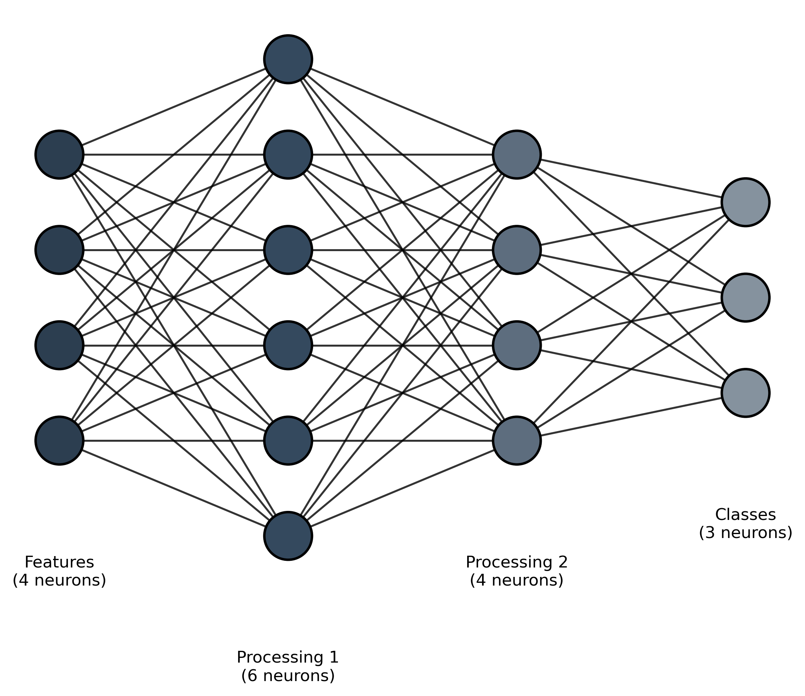
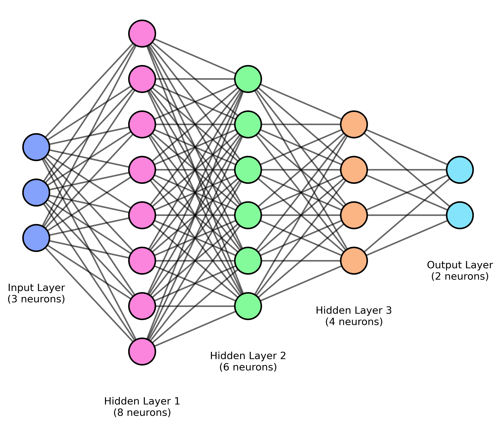
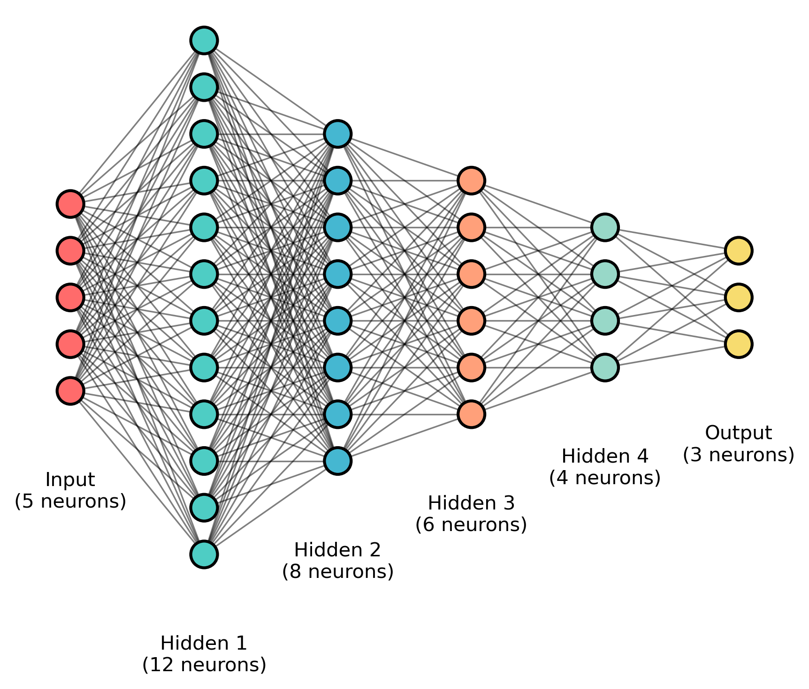

# Neural Network Architecture Visualizer

A Python application for creating paper-ready visualizations of Multi-Layer Perceptron (MLP) architectures with customizable parameters and clean, minimalist design.

## ✨ Example Outputs

### 📊 Academic Style (Professional)


*Clean, professional visualization perfect for research papers and presentations*

### 🌈 Vibrant Style (Colorful)


*Modern, colorful design ideal for educational materials and interactive presentations*

### 🏗️ Deep Network (Complex Architecture)


*Comprehensive visualization for complex architectures with multiple hidden layers*

## Features

- **Real-time Preview**: See changes instantly as you adjust parameters
- **Professional Examples**: Pre-configured styles for academic, vibrant, and deep network visualizations
- **Customizable Parameters**:
  - Node diameter and individual layer colors
  - Edge width and opacity  
  - Layer spacing and node spacing
  - Hidden layer configuration
  - Number of neurons per layer
- **Multiple Export Formats**: PNG, PDF, SVG, JPEG
- **Configuration Management**: Save and load parameter configurations for reproducibility
- **Academic Style**: Clean, minimalist design perfect for research papers
- **Optional Labels**: Toggle layer labels on/off

## Installation

1. Clone this repository:
```bash
git clone <repository-url>
cd paper-ready-architecture
```

2. Install dependencies:
```bash
pip install -r requirements.txt
```

## Usage

### Running the Application

```bash
python main.py
```

### GUI Interface

The application provides an intuitive GUI with:

1. **Control Panel** (left side):
   - **Network Structure**: Configure input, hidden layers, and output neurons
   - **Visual Parameters**: Adjust node size, edge properties, and spacing
   - **Layer Colors**: Click "Configure Layer Colors..." to open color dialog
   - **Labels**: Toggle and customize layer labels
   - **Export Settings**: Set dimensions and DPI for export

2. **Preview Panel** (right side):
   - Real-time visualization of your neural network
   - Auto-updates as you change parameters

### Key Parameters

- **Input Neurons**: Number of neurons in the input layer (1-20)
- **Hidden Layers**: Comma-separated list of neurons per hidden layer (e.g., "4,4,3")
- **Output Neurons**: Number of neurons in the output layer (1-20)
- **Node Diameter**: Size of neural network nodes (10-80)
- **Layer Colors**: Individual color selection for each layer via dedicated dialog
  - Color picker for each layer (Input, Hidden 1, Hidden 2, ..., Output) 
  - Preset color schemes (Default, Academic Grayscale, Blue→Red Gradient)
  - Random color generator for quick variations
- **Edge Width**: Thickness of connections between neurons (0.5-5.0)
- **Edge Opacity**: Transparency of connections (0.1-1.0)
- **Layer Spacing**: Horizontal distance between layers (50-300)
- **Node Spacing**: Vertical distance between nodes in same layer (20-120)

### Exporting Images

1. Adjust your parameters as desired
2. Go to **File → Export Image**
3. Choose format (PNG, PDF, SVG, JPEG) and location
4. The configuration will be automatically saved alongside the image

### Configuration Management

- **Auto-save**: Configurations are automatically saved as you work
- **Manual Save**: File → Save Configuration
- **Load**: File → Load Configuration to restore previous settings

## Examples

### Basic MLP
- Input: 3 neurons (Blue)
- Hidden: 4, 4 neurons (Green, Yellow)
- Output: 2 neurons (Red)

### Deep Network
- Input: 5 neurons (Dark Blue)
- Hidden: 8, 6, 4 neurons (Blue, Orange, Purple)
- Output: 3 neurons (Green)

### Layer Color Dialog Features
- **Individual Selection**: Click "Configure Layer Colors..." button
- **Direct Hex Input**: Type colors directly (e.g., `#84A1FB`, `#FB84DC`)
  - Real-time validation as you type
  - Instant color preview updates
  - Supports all standard 6-digit hex codes
- **Color Presets**:
  - **Default**: Blue, Green, Red, Yellow scheme
  - **Academic**: Professional grayscale for publications
  - **Gradient**: Smooth blue-to-red transitions
- **Interactive Tools**:
  - **Color Picker**: Choose any custom color via dialog
  - **Random Generator**: Quick color variations
  - **Real-time Preview**: See changes immediately

## File Structure

```
paper-ready-architecture/
├── main.py                 # Main entry point
├── requirements.txt        # Python dependencies
├── README.md              # This file
├── src/
│   ├── __init__.py        # Package initialization
│   ├── gui_app.py         # Main GUI application
│   ├── mlp_generator.py   # Neural network diagram generator
│   └── config_manager.py  # Configuration management
├── tests/                 # Test suite
│   ├── test_config_manager.py    # Configuration tests
│   ├── test_mlp_generator.py     # Generator tests
│   ├── test_integration.py       # Integration tests
│   └── run_tests.py             # Test runner
├── assets/                # Example images
│   ├── example_academic.png     # Professional examples
│   ├── example_vibrant.png      # Colorful examples
│   └── example_deep.png         # Deep network examples
├── examples/              # Usage examples
│   └── basic_usage.py     # Basic usage example
└── configs/               # Saved configurations (created automatically)
```

## Dependencies

- matplotlib: For generating diagrams
- numpy: Numerical computations
- Pillow: Image processing
- PyYAML: Configuration file handling
- tkinter: GUI framework (usually included with Python)

## Testing

The project includes a comprehensive test suite to ensure reliability:

```bash
# Run all tests
cd tests
python run_tests.py

# Run specific test modules
python run_tests.py config_manager
python run_tests.py mlp_generator
python run_tests.py integration
```

See `tests/README.md` for detailed testing information.

## Contributing

This project is designed for academic and research use. Feel free to extend it with additional neural network architectures or visualization features. Please run the test suite before submitting contributions.

## License

MIT License - see LICENSE file for details.

## Academic Use

This tool is specifically designed for creating high-quality figures for academic papers. The generated diagrams follow clean, minimalist design principles suitable for scientific publications.

### Recommended Settings for Papers:
- **DPI**: 300 or higher
- **Format**: SVG (for vector graphics) or PNG (for raster)
- **Colors**: Use contrasting colors that work well in grayscale
- **Node Size**: Adjust based on your paper's figure size requirements