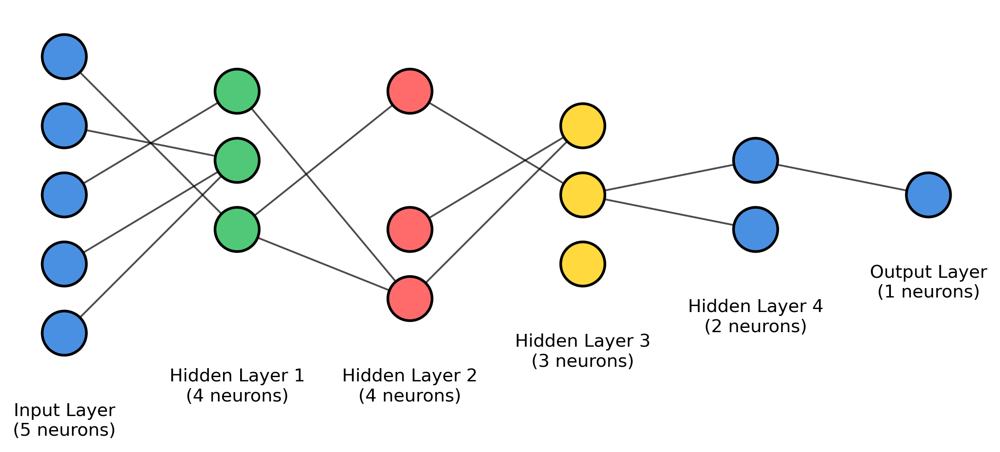

# Neural Network Architecture Visualizer

A simple Python GUI tool to create paper-ready visualizations of neural network architectures (MLP & CNN) with customizable colors, pruning, and export options.

## Features
- **MLP & CNN Visualization**: Draw both Multi-Layer Perceptrons and Convolutional Neural Networks.
- **Custom Layer Colors**: Set individual colors for each layer, with presets and randomization.
- **Pruning**: Visualize neuron and synapse pruning for sparse networks.
- **Real-time Preview**: See changes instantly as you edit parameters.
- **Export**: Save diagrams as PNG, PDF, SVG, or JPEG.
- **Configurable Parameters**: Input shape, layers, colors, spacing, and more.

## Example Outputs

### Academic Style


### Vibrant Style


### Deep Network


### CNN Example


### Pruning Visualizations

**Before Pruning**


**Neuron Pruning**


**Synapse Pruning**


**Combined Pruning**


## Usage

1. Install dependencies:
   ```bash
   pip install -r requirements.txt
   ```
2. Run the app:
   ```bash
   python main.py
   ```
3. Use the GUI to:
   - Choose MLP or CNN mode
   - Set input shape, layers, and colors
   - Enable pruning if desired
   - Preview and export your diagram

## Assets
- All example images above are generated by this tool and can be found in the `assets/` folder.

## Contributing
We are happy to accept contributions! Feel free to open issues or pull requests to add features, fix bugs, or suggest improvements.

## License
MIT

## Future Work
- **Transformer Visualization**: Add support for visualizing Transformer architectures (e.g., attention heads, encoder/decoder blocks).
- **RNN/LSTM Support**: Visualize recurrent neural networks and their variants.
- **Custom Layer Types**: Allow users to define and visualize custom layers.
- **Interactive Editing**: Enable drag-and-drop or direct manipulation of network diagrams.
- **Export to LaTeX/TikZ**: Support exporting diagrams for direct inclusion in LaTeX documents.